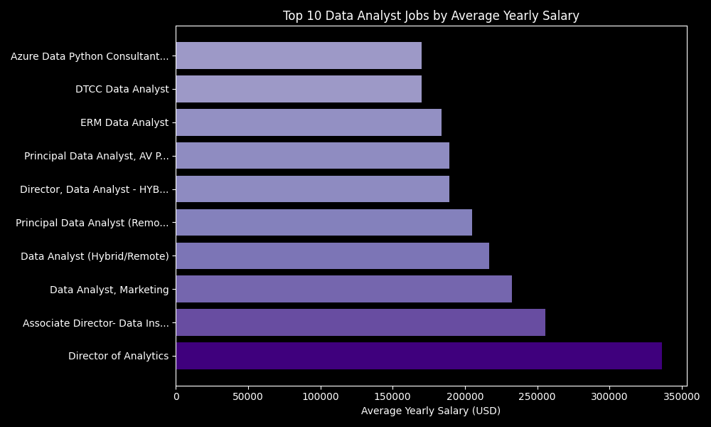
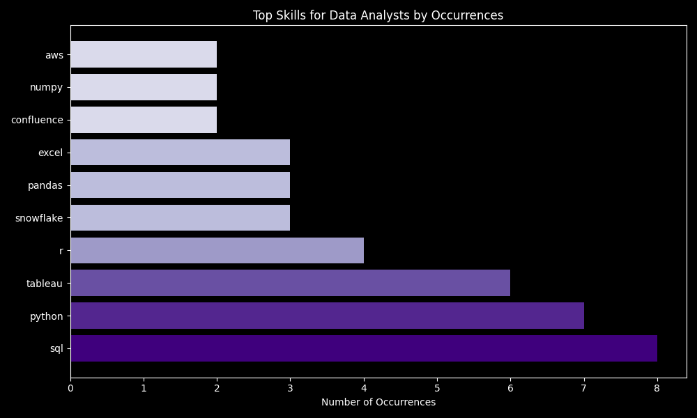

# SQL Project 
## Introduction
Questions to Answer:
1. What are the top-paying jobs for a Data Analyst? [SQL File](/project_sql/1_top_paying_jobs.sql)
2. What are the skills required for these top-paying roles? [SQL File](/project_sql/2_top_paying_jobs_skills.sql)
3. What are the most in-demand skills for a Data Analyst? [SQL File](/project_sql/3_top_demanded_skills.sql)
4. What are the top skills based on salary for a Data Analyst? [SQL File](/project_sql/4_top_paying_skills.sql)
5. What are the most optimal skills to learn? [SQL File](/project_sql/5_optimal_skills.sql)
6. What are the jobs that are specific to me? [SQL File](/project_sql/6_specific_jobs.sql)

Data is provided by Luke Barousse through his [SQL Course](https://lukebarousse.com/sql). 

## Software I Used
For my analysis of the data analyst job market, I used several key tools:

- **SQL:** The backbone of my analysis, allowing me to query the database and unearth critical insights.
- **PostgreSQL:** The chosen database management system, ideal for handling the job posting data.
- **Visual Studio Code:** My go-to for database management, executing SQL queries and carrying out python analysis.
- **Git & GitHub:** Essential for version control and sharing my SQL scripts and analysis, ensuring collaboration and project tracking.

### 1. Top Paying Data Analyst Jobs
To identify the highest-paying roles, I filtered data analyst positions by average yearly salary and location, focusing on remote jobs. This query highlights the high paying opportunities in the field.

```sql
SELECT
    jpf.job_id, 
    jpf.job_title, 
    jpf.job_location, 
    jpf.job_schedule_type, 
    jpf.salary_year_avg, 
    jpf.job_posted_date,
    c.name AS company_name
FROM 
    job_postings_fact AS jpf
LEFT JOIN company_dim AS c ON jpf.company_id = c.company_id
WHERE
    job_title_short = 'Data Analyst' AND
    job_location = 'Anywhere' AND
    salary_year_avg IS NOT NULL
ORDER BY
    salary_year_avg DESC
LIMIT 10;
```
Through Python, I created a bar chart of the top 10 salaries for data analyst jobs. The plotting code can be found here: [Top 10 Data Analyst Jobs](project_sql/1_top_paying_jobs.py)


*Bar graph visualizing the salary for the top 10 salaries for data analysts*
 
 ### 2. Skills for Top Paying Jobs
To understand what skills are required for the top-paying jobs, I joined the job postings with the skills data, providing insights into what employers value for high-compensation roles.
```sql
WITH top_paying_jobs AS (
    SELECT
        jpf.job_id, 
        jpf.job_title, 
        jpf.salary_year_avg, 
        c.name AS company_name
    FROM 
        job_postings_fact AS jpf
    LEFT JOIN company_dim AS c ON jpf.company_id = c.company_id
    WHERE
        job_title_short = 'Data Analyst' AND
        job_location = 'Anywhere' AND
        salary_year_avg IS NOT NULL
    ORDER BY
        salary_year_avg DESC
    LIMIT 10
)

SELECT 
    top_paying_jobs.*,
    skills_dim.skills
FROM top_paying_jobs
INNER JOIN skills_job_dim ON top_paying_jobs.job_id = skills_job_dim.job_id
INNER JOIN skills_dim ON skills_job_dim.skill_id = skills_dim.skill_id
ORDER BY 
    salary_year_avg DESC;
```

Through Python, I created a bar chart of the top 10 skills for data analyst jobs. The plotting code can be found here: [Top 10 Skills](project_sql/2_top_paying_jobs_skills.py)


*Bar graph visualizing the count of skills for the top 10 paying jobs for data analysts*

### 3. In-Demand Skills for Data Analysts

This query helped identify the skills most frequently requested in job postings, directing focus to areas with high demand.

```sql
SELECT 
    skills,
    COUNT(skills_job_dim.job_id) AS demand_count
FROM job_postings_fact
INNER JOIN skills_job_dim ON job_postings_fact.job_id = skills_job_dim.job_id
INNER JOIN skills_dim ON skills_job_dim.skill_id = skills_dim.skill_id
WHERE
    job_title_short = 'Data Analyst' 
--  AND job_work_from_home = TRUE
GROUP BY 
    skills
ORDER BY 
    demand_count DESC
LIMIT 5;
```

| Skills   | Demand Count |
|----------|--------------|
| SQL      | 92628         |
| Excel    | 67031         |
| Python   | 57326         |
| Tableau  | 46554         |
| Power BI | 39468         |

*Table of the demand for the top 5 skills in data analyst job postings*

### 4. Skills Based on Salary
Exploring the average salaries associated with different skills revealed which skills are the highest paying.
```sql
SELECT 
    skills,
    ROUND(AVG(salary_year_avg), 0) AS avg_salary
FROM job_postings_fact
INNER JOIN skills_job_dim ON job_postings_fact.job_id = skills_job_dim.job_id
INNER JOIN skills_dim ON skills_job_dim.skill_id = skills_dim.skill_id
WHERE
    job_title_short = 'Data Analyst' 
    AND salary_year_avg IS NOT NULL
--  AND job_work_from_home = TRUE
GROUP BY 
    skills
ORDER BY 
    avg_salary DESC
LIMIT 25;
```

| Skills        | Average Salary ($) |
|---------------|-------------------:|
| svn           |            400,000 |
| solidity      |            179,000 |
| couchbase     |            160,515 |
| datarobot     |            155,486 |
| golang        |            155,000 |
| mxnet         |            149,000 |
| dplyr         |            147,633 |
| vmware        |            147,500 |
| terraform     |            146,734 |
| twilio        |            138,500 |

*Table of the average salary for the top 10 paying skills for data analysts*

### 5. Most Optimal Skills to Learn

Combining insights from demand and salary data, this query aimed to pinpoint skills that are both in high demand and have high salaries, offering a strategic focus for skill development.

```sql
SELECT
    skills_dim.skill_id, 
    skills_dim.skills,
    COUNT (skills_job_dim. job_id) AS demand_count, 
    ROUND (AVG (job_postings_fact.salary_year_avg),0) AS avg_salary
FROM 
    job_postings_fact
INNER JOIN skills_job_dim ON job_postings_fact.job_id = skills_job_dim.job_id
INNER JOIN skills_dim ON skills_job_dim.skill_id = skills_dim.skill_id
WHERE
    job_title_short = 'Data Analyst'
    AND salary_year_avg IS NOT NULL
    AND job_work_from_home = True
GROUP BY
    skills_dim.skill_id
HAVING
    COUNT (skills_job_dim. job_id) >= 10
ORDER BY
    avg_salary DESC, 
    demand_count DESC
LIMIT 25;
```

| Skill ID | Skills       | Demand Count | Average Salary ($) |
|----------|--------------|--------------|-------------------:|
| 98       | kafka        | 40           |            129,999 |
| 101      | pytorch      | 20           |            125,226 |
| 31       | perl         | 20           |            124,686 |
| 99       | tensorflow   | 24           |            120,647 |
| 63       | cassandra    | 11           |            118,407 |
| 219      | atlassian    | 15           |            117,966 |
| 96       | airflow      | 71           |            116,387 |
| 3        | scala        | 59           |            115,480 |
| 169      | linux        | 58           |            114,883 |
| 234      | confluence   | 62           |            114,153 |


*Table of the most optimal skills for data analyst sorted by salary*

### 6. Specific Jobs

Using the skills I have learnt to find jobs that are specific to me. In this case looking for data jobs that are in the United Kingdom and are suitable for a graduate.

```sql
SELECT
--    jpf.job_id, 
    jpf.job_title, 
    c.name AS company_name,
    jpf.job_location, 
--    jpf.job_schedule_type, 
    jpf.salary_year_avg 
--    jpf.job_posted_date
FROM 
    job_postings_fact AS jpf
LEFT JOIN company_dim AS c ON jpf.company_id = c.company_id
WHERE
    jpf.job_title LIKE '%Data%' AND
--    jpf.job_title NOT LIKE '%Senior%' AND 
--    jpf.job_title NOT LIKE '%Lead%' AND
--    jpf.job_title NOT LIKE '%Director%' AND
    (jpf.job_title LIKE '%Graduate%' OR jpf.job_title LIKE '%Junior%') AND
    jpf.job_country = 'United Kingdom' AND
    jpf.job_schedule_type = 'Full-time' AND
    jpf.salary_year_avg IS NOT NULL
ORDER BY
    salary_year_avg DESC;
```

| Job Title                                       | Company Name       | Job Location   | Average Salary ($) |
|-------------------------------------------------|--------------------|----------------|--------------------:|
| Junior Data Analyst                             | Wise Technical Ltd | London, UK     |             98,500.0 |
| Graduate Data Engineer                          | Blend360           | Edinburgh, UK  |             97,444.0 |
| Junior Data Scientist (Commercial)              | Salary Finance     | United Kingdom |             70,000.0 |
| Graduate Data Scientist                         | Shift Technology   | London, UK     |             69,962.5 |
| Junior Data Scientist                           | Arena Online Ltd   | Droitwich, UK  |             69,962.5 |
| Graduate Data Scientist/Analyst/BI Consultant   | Blend360           | Edinburgh, UK  |             69,962.5 |
| Graduate Data Scientist - 2023 Programme        | CGG                | United Kingdom |             64,821.5 |
| Junior Marketing Data Scientist                 | Twitch             | London, UK     |             64,821.5 |
| Graduate / Junior Financial Data Analyst        | Together           | Cheadle, UK    |             57,500.0 |
| Gradute Data Analyst                            | IBI Group          | Newark, UK     |             57,500.0 |

*Table of all the jobs that are specific to my requirements, sorted by salary*

# Conclusions

From the analysis, several general insights emerged:

1. **Top-Paying Data Analyst Jobs**: The highest-paying jobs for data analysts that allow remote work offer a wide range of salaries, the highest at $350,000!
2. **Skills for Top-Paying Jobs**: High-paying data analyst jobs require advanced proficiency in SQL, suggesting it’s a critical skill for earning a top salary.
3. **Most In-Demand Skills**: SQL is also the most demanded skill in the data analyst job market, thus making it essential for job seekers.
4. **Skills with Higher Salaries**: Specialized skills, such as SVN and Solidity, are associated with the highest average salaries, indicating a premium on niche expertise.
5. **Optimal Skills for Job Market Value**: SQL leads in demand and offers for a high average salary, positioning it as one of the most optimal skills for data analysts to learn to maximize their market value.
6. **Specific Jobs to me**: Although there are only 10 jobs that fit my specifications, a good range of jobs were found and it shows that there are jobs available to graduates.

# What I Learned

- **SQL Proficiency**:
   - Develop a strong understanding of SQL syntax and commands for data retrieval, manipulation, and management.
   - Learn to write complex queries using JOINs, subqueries, and aggregate functions.

- **Problem-Solving Skills**:
   - Enhance critical thinking by solving real-world data-related problems.
   - Apply logical reasoning to analyse datasets, identify patterns, and derive actionable insights.

- **Data Analysis**:
   - Master techniques for cleaning, transforming, and analysing large datasets.
   - Use SQL to perform exploratory data analysis, allowing for informed decision-making based on data.

- **Data Visualization with Python**:
   - Learn to use Python libraries such as Matplotlib for effective data visualisation.
   - Gain the ability to create informative and visually appealing charts and graphs to communicate data findings.

- **Data Interpretation**:
   - Develop skills to interpret analytical results and visualise data trends.
   - Communicate insights effectively to stakeholders, facilitating data-driven decision-making.

- **Integration of SQL and Python**:
   - Understand how to integrate SQL queries within Python scripts for enhanced data manipulation and analysis.
   - Utilise libraries like Pandas to manage and analyse data efficiently after extraction from SQL databases.

- **Hands-On Experience**:
   - Engage in practical exercises and projects that simulate real-world data analysis scenarios.
   - Build a portfolio of projects that showcase your ability to solve data-related challenges.

- **Version Control with GitHub**:
   - Learn to use GitHub for version control and collaboration on data projects.
   - Publish your projects to GitHub, creating a professional portfolio that showcases your work and contributions to the data analysis community.